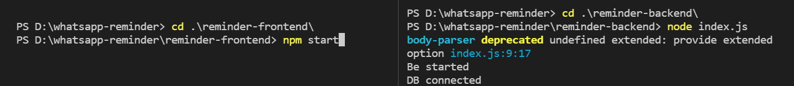
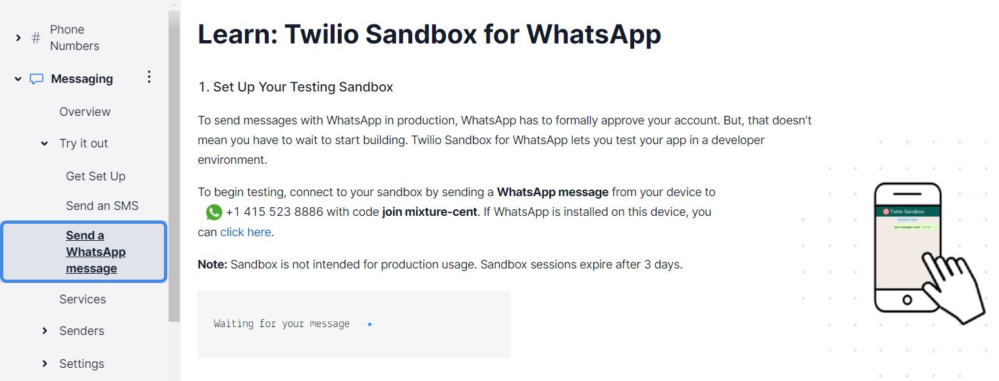
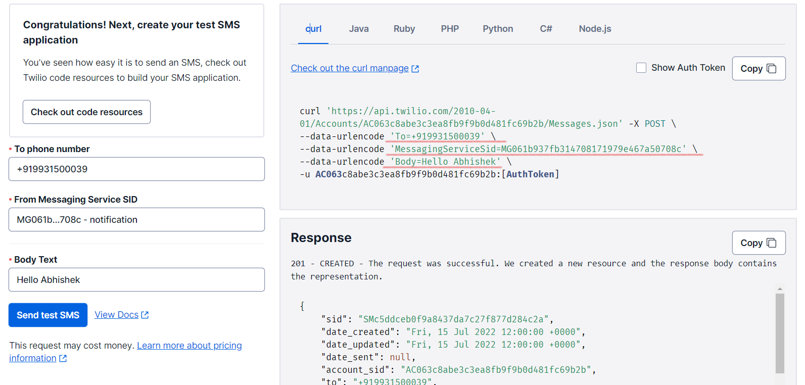

<h1 align="center">WhatsApp💜 Reminder ⏰ </h1>

<h4 align="center">WhatsApp  Reminder is a whatsapp bot built with Twilio's APIs, ReactJs, ExpressJS and MongoDB. It can send reminders through text messages in whatsapp.</h4>

<!-- <div align="center">

</div> -->

<h1 align="center">Usage</h2>


## 🐱‍🏍Result 
- Some Glimpse of our Results<br>
✔️Here you can See the Message reminder recived on whatsapp .

✔️Here you can see how we create different - different reminder .


### 🧧Starting Frontend

1. Clone this Repository `https://github.com/abhishekrawe/WhatsApp-Reminder.git`
2. Go to --> `Whatsapp-reminder` , cd to --> `reminder-frontend` and `npm install` in terminal
3. `npm start`.

### 🃏Starting Backend

1. Clone this Repository `https://github.com/abhishekrawe/WhatsApp-Reminder.git`
2. Go to --> `Whatsapp-reminder` , cd to --> `reminder-backend` and `npm install` in terminal
3. `node index.js`



### 🔴Set Up whatsapp for Twilio

 1.  [Login](https://www.twilio.com/login) with your email ID on twilio , it give you free trial `$15.425`
 2.  [Go to Console](https://www.twilio.com/console/) where you have three options in left side Phone number 📞 , messaging 📧and Voice ➿ .

 3. Select `Messaging📧` -> Go to `Try it Out` -> and Select  `Send a Whatsapp message`

 4. [Click on this link](https://api.whatsapp.com/send/?phone=%2B14155238886&text=join+mixture-cent&app_absent=0). This will open up whatsapp on your mobile / PC.
 
 5. The invitation text has already been filled into the message box, just send the given message (for eg join mixture-cent) or any message and you are in! 🎉.
   - [Twilio refrence WhatsApp Business API ](https://www.twilio.com/whatsapp).
   - Whatsapp reminding functionality by Twilio added in index.js

     ```
                  const accountSid = process.env.ACCOUNT_SID;
                  const authToken = process.env.AUTH_TOKEN;
                  const client = require("twilio")(accountSid, authToken);

                  client.messages
                    .create({
                      body: reminder.reminderMsg,
                      from: "whatsapp:+14155238886",
                      to: "whatsapp:+919931500039",
                    })
                    .then((message) => console.log(message.sid))
                    .done();
     ```
### 🔴Set Up SMS with Messaging Service

 1.  [Go to Console](https://www.twilio.com/console/) where you have three options in left side Phone number 📞 , messaging 📧and Voice ➿ .

 2. Select `Messaging📧` -> Go to `Try it Out` -> and Select  `Send an SMS with Messaging Services`

 3. First you need to setUp clicking on Get Set Up they will Provide a Unique Messaging Service SID
 4. You can simple check it with Curl code on your terminal to get the SMS on your Phone 
 
 
 ```
           const accountSid = 'AC063c8abe3c3ea8fb9f9b0d481fc69b2b'; 
           const authToken = '[AuthToken]'; 
           const client = require('twilio')(accountSid, authToken); 
 
           client.messages 
           .create({ 
           body: 'Hello Abhishek',  
           messagingServiceSid: 'MG061b937fb314708171979e467a50708c',      
           to: '+919931500039' 
           }) 
          .then(message => console.log(message.sid)) 
          .done();
```

5. How to add your own ACCOUNT_SID  and AUTH_TOKEN

      [Go to Console](https://www.twilio.com/console/) here you find your own unique account_sid and Auth_id 

      Try to make `.env` file and Add your ACCOUNT_SID=____________ and AUTH_TOKEN=___________


### 🔔Setting up reminders

- Simple click on `Reminder notes Here......` and Add your Reminder that you want to remind .
- The general format is `set <Reminder-name (Not required)> <task-time (required)> <task-date (it take Present date if not given)>`.
  - `task-name`: **Not required field**. Type the task that you want to be reminded about in .
  - `task-date`: **An optional field**. The default value is current date however you can also type here `today` if you want to put some extra efforts. For dates other than current date, type in **DD/MM/YY** format.
  - `task-time`: **A required field**. Type the time you want to be reminded at in **12 HOUR** format `AM or PM `.
- Examples :
  - Set a reminder for Conducting Session at 5:23 PM today --> `Session on ReactJS` `2/15/2022 5:23 AM `
  - Set a reminder for Todays for Going to Gym at 7:00 PM --> `Go to Gym` `2/15/2022(No Need to give the Date- It take by Default for Today ) 5:23 AM `

### 😪Keep in mind

Just like me, this bot is lazy 🦥 and needs to sleep 😴 0000 to 0600 (IST) everyday (due to Heroku's policies). So try **NOT** to set any reminders for the above timings. Also Twilio's WhatsApp API is in beta which may cause issues or even stop working all together. **Also this project is eventually destined to be sun-setted after the trial balance of Twilio is over**.


## 🐛 Bug Reporting

Feel free to [open an issue](https://github.com/abhishekrawe/WhatsApp-Reminder/issues) on GitHub if you find any bug.

## ⭐ Feature Request

Feel free to [Open an issue](https://github.com/abhishekrawe/WhatsApp-Reminder/issues) on GitHub to request any additional features you might need for your use case.

## ♻️ Contributing

* **Abhishek Rawe** - *Developer* - [Website](https://abhishekrawe.netlify.app/)

## ❤️Authors

* **Abhishek Rawe** - *Developer* Who's the author of those contents - [Abhishek Rawe](https://www.linkedin.com/in/abhishekrawe/)

## 📜 License

This software is open-source, licensed under the [MIT License](https://abhishekrawe.netlify.app/blob/main/LICENSE).

[](https://github.com/abhishekrawe)
